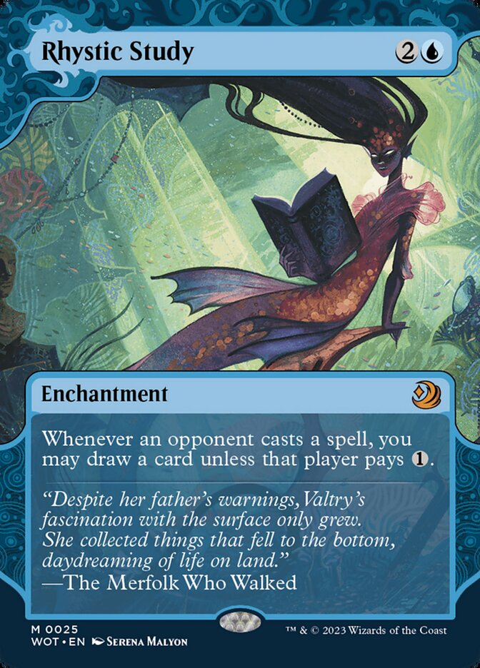
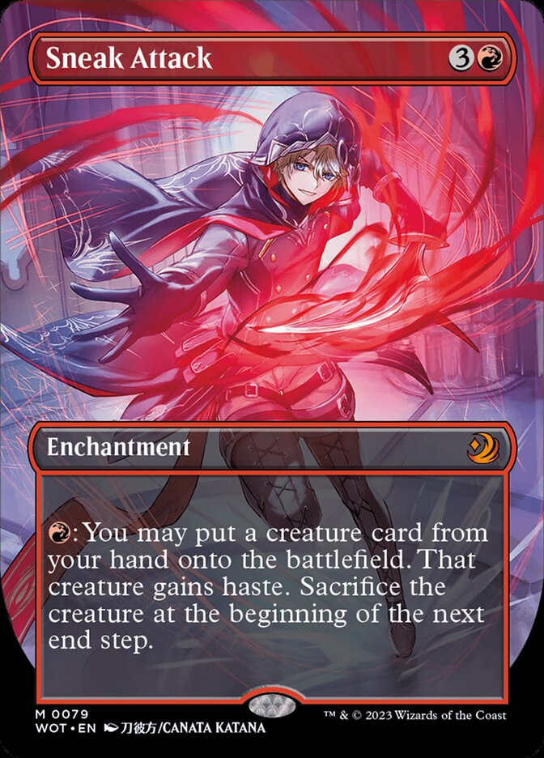
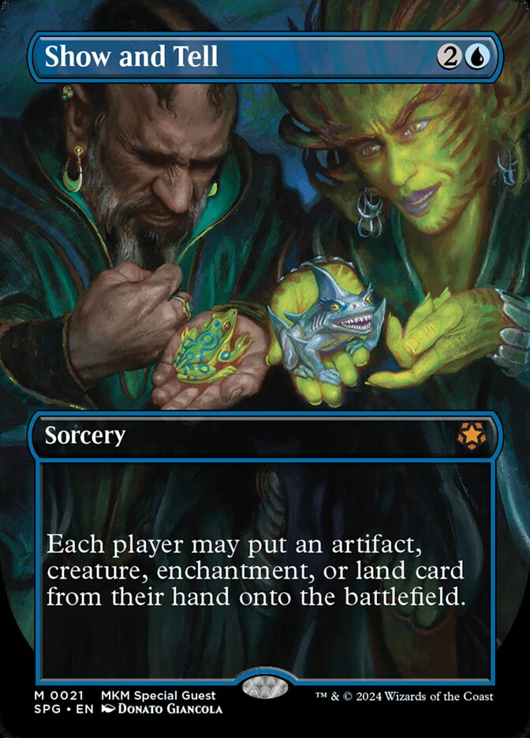
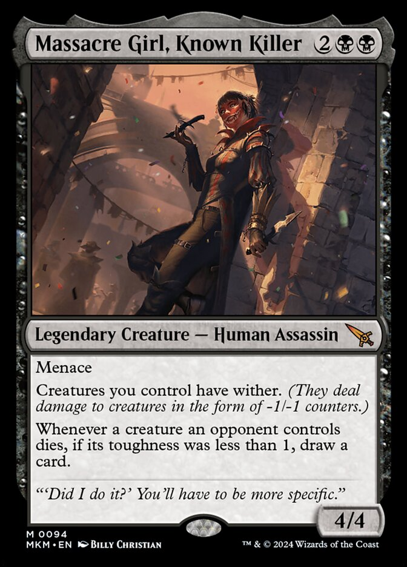

# MTGScryDL

I'm learning Python and love Magic: The Gathering. I decided that I wanted to attempt to download all of my cards from a CSV file I created using the awesome app for Android called [Delver Lens](https://www.delverlab.com/).

This script reaches out to Scryfall with your list of ID's creates the API call, pulls the name, set, and image then downloads the card images into a directory while naming them correctly. 

This is a work in progress, please don't beat me up to hard on my coding.

I have added my current "more Modern" list of cards that I have scanned so far for reference, but basically you'll just need a table column named ``Scryfall IDs`` and you're off to the races.



## Requirements

You'll need the following to run this script

### Python Version and Libraries:
```
- python3
- requests
- json
- pandas
- time
- shutil
```
### Directories inside script directory titled (you'll need to change directory paths in script): 
```
- images/single 
- images/multi 
- images/multi/backs
```
### CSV file of collection with Scryfall ID's column
```
- all_cards.csv 
```

## Python code licensed under MIT
```


Copyright 2024 Caleb Fultz aka cfultz

Permission is hereby granted, free of charge, to any person obtaining a copy of this software and associated documentation files (the “Software”), to deal in the Software without restriction, including without limitation the rights to use, copy, modify, merge, publish, distribute, sublicense, and/or sell copies of the Software, and to permit persons to whom the Software is furnished to do so, subject to the following conditions:

The above copyright notice and this permission notice shall be included in all copies or substantial portions of the Software.

THE SOFTWARE IS PROVIDED “AS IS”, WITHOUT WARRANTY OF ANY KIND, EXPRESS OR IMPLIED, INCLUDING BUT NOT LIMITED TO THE WARRANTIES OF MERCHANTABILITY, FITNESS FOR A PARTICULAR PURPOSE AND NONINFRINGEMENT. IN NO EVENT SHALL THE AUTHORS OR COPYRIGHT HOLDERS BE LIABLE FOR ANY CLAIM, DAMAGES OR OTHER LIABILITY, WHETHER IN AN ACTION OF CONTRACT, TORT OR OTHERWISE, ARISING FROM, OUT OF OR IN CONNECTION WITH THE SOFTWARE OR THE USE OR OTHER DEALINGS IN THE SOFTWARE.

```